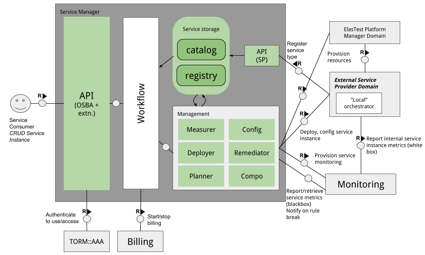

# Development Documentation

## Service Manager Architecture




There are a number of components to the ESM and here we provide a brief explanation of each.

* **API (OSBA, extensions)**: This is the main service consumer entry point. The API allows the creation and management of service instances.
* **API (SP)**: This is the API that allows service providers to register and update their service offerings within the SM. This is the representation of extensions.
* **Workflow**: manages the interactions between the various functional components of the service manager
* **Catalog**: query available services, services offered by the SM
* **Registry**: query service instances currently managed by the SM
* **AAA**: not provided by ElasTest. Currently uses OpenStack Keystone.
* **Billing**: not provided by ElasTest. Currently provided by Cyclops.
* **Monitoring**: monitors service from external perspective e.g. response time, latency, RTT etc.
* **Measurer**: measures service metrics and reports them to the EMP
* **Deployer**: requests creation of service, adaptors to “local orchestrator”
* **Config**: configures a created instance
* **Remediator**: if notified of plan/SLA breach, the remediator takes necessary actions to resolve the problem.
* **Compo**: responsible for composition of services and resolution of dependencies a service has
* **Planner**: plans deployment, Can also select the best service provider if there's none specified or the best location based on technical requirements (latency, geo-loc etc.). Also ensures that if there are dependencies that they are selected for deployment.
* **ElasTest Platform Manager (EPM)**: If service provider uses own resources then this is optional. For the case of ElasTest it is mandatory to use the EPM.
* “Local” Orchestrator provided by service owner. Orchestration of services and dependencies by SM. This abstraction allows the service provider either use its own system to provide the service’s resources or to use those by the EPM

## Service Manager API

This service broker was in part generated by the [swagger-codegen](https://github.com/swagger-api/swagger-codegen) project. By using the [OpenAPI-Spec](https://github.com/swagger-api/swagger-core/wiki) from a remote server, you can easily generate a server stub. Using the swagger specification for this broker, you can also generate a client to interact with the broker, should `curl` not be your preference. The implementation uses the [Connexion](https://github.com/zalando/connexion) library on top of Flask and requires Python 3.6. To use Python 3.5 you will need the `typing` module dependency, but this is included in the `requirements.txt` file. Python 2.x is not supported.

See `./gen_api_skels.sh` on how the command line is to generate the code.

The ESM uses the [Connexion](https://github.com/zalando/connexion) library on top of Flask.

To run the ESM, please execute the following from the root directory:

```
virtualenv --python=python3.6 .env
source .env/bin/activate
pip3 install -r src/requirements.txt
cd src
python3 ./runesm.py
```

If you want to view the Swagger UI you can simply navigate to this URL in your browser:
```
http://localhost:8080/ui/
```

To retrieve the swagger specification of the running ESM simply use `curl` or `wget` against this URL
```
http://localhost:8080/swagger.json
```

## Running Tests

Ensure that you run from a virtual environment (see above).

```shell
pip3 install -r tests/requirements.txt
sudo pip install tox docker-tox
```

From the root of the project you can run all tests with:

```
tox
```

By default, the mongodb backend is enabled in tox. If you want to change this or if the Docker tests are run edit the variables `MONGODB_TESTS` and/or `DOCKER_TESTS` in `tox.ini`. There are other tests that can be ran by setting the appropriate variable. See `tox.ini` for more details.

If you don't want to run and use `nosetests` you can easily do so. To enable/disable the Mongo or Docker tests simply set the shell variables listed in `tox.ini` as needed.

To interact with the API after running `runsm.py`, you can use the [Postman](https://www.getpostman.com) collection that's under `tests/postman`.

You can see the [current test coverage here](https://codecov.io/gh/elastest/elastest-service-manager).


## Extending

### Data Store

Subclass `adapters.datastore.Store` and implement for you persistence system.

Currently supported:

* `adapters.datastore.InMemoryStore`: this is a datastore driver that holds all ESM state in memory. To be used for testing only as restarting the ESM process will destroy all recorded information.


* `adapters.datastore.MongoDB`: this is a datastore driver that persists all ESM state into mongodb. Data is kept across reboots of the ESM process.

### Resource Manager

Subclass `adapters.resources.Backend` and implement for you persistence system. You will then have to register your Backend driver with the `adapters.resources.ResourceManager` class.

Currently supported:

* `adapters.resources.DummyBackend`: This is a NoOp driver used for speedy testing.


* `adapters.resources.DockerBackend`: Uses a docker-compose file to deploy the service software. This can point not only to a local docker deployment (not distributed), but also to a docker swarm.

### Monitor Probes

These monitor probes only carryout service-level measurements. Resource-level measurements are provided by the integration of [ElasTest's EMP, Sentinel](https://github.com/elastest/elastest-monitoring-platform). This is currently work in progress but the aims will be for users of the ESM to easily define their own service-level metrics that should be monitored.

## Building with Docker

There is a docker build file `./Dockerfile` in the root of this project. You can use this to create a docker image that can then be ran upon your local docker environment.

### To Build Locally

```shell
docker build -t elastest/elastest-service-manager:latest ./
```

## Running the ESM Outside of a Virtualisation Technology

Ensure you have all dependencies required: `pip3 install -r src/requirements.txt`

Configure the following OS environment variables:

* `ESM_PORT`: this is the port under which the service broker runs. By default it runs on `8080`.
* `ESM_CHECK_PORT`: this is the port where health checks are served. By default it runs on `5000`.
* `ESM_MONGO_HOST`: this is the host where a mongodb service is running. It is used to persist ESM state. If it's not set then an in-memory store is used.
* For further configuration of the ESM, please see the [set of configuration environment variables here](./config-env-vars.md)

Example config and run:

```shell
$ export ESM_PORT=9999
$ export ESM_CHECK_PORT=8888
$ export ESM_MONGO_HOST=localhost
$ python ./runesm.py
2017-07-26 11:37:22,918 [58778] INFO     adapters.datasource: Using the MongoDBStore.
2017-07-26 11:37:22,918 [58778] INFO     adapters.datasource: MongoDBStore is persistent.
2017-07-26 11:37:23,382 [58778] INFO     adapters.resources: Adding docker-compose alias to DockerBackend
2017-07-26 11:37:23,382 [58778] INFO     adapters.resources: Adding k8s alias to KubernetesBackend
2017-07-26 11:37:23,389 [58778] INFO     __main__: OSBA API and ElasTest extensions API created.
2017-07-26 11:37:23,390 [58778] INFO     __main__: ESM available at http://0.0.0.0:9999
2017-07-26 11:37:23,390 [58778] INFO     __main__: ESM Health available at http://0.0.0.0:8888
2017-07-26 11:37:23,390 [58778] INFO     __main__: Press CTRL+C to quit.
```

The service manager endpoint should only be the scheme (http or https) and the fully qualified host name, optionally including the port number if it differs from the standard port 80 or 443.

## Continuous Test and Integration
There is a `Jenkinsfile` in the root of this project that defines the Jenkins pipeline that executes all tests and if successful builds and pushes a new docker image to docker hub. This pipeline also generates the required code coverage statistics - [](https://codecov.io/gh/elastest/elastest-service-manager)

## Notes

To build the swagger-codegen [tool yourself](https://github.com/swagger-api/swagger-codegen/tree/master#building)

``` sh
# server files
# assumes a brew installation of swagger code gen
SWAGGER_CODE_GEN="/usr/local/bin/swagger-codegen"
$SWAGGER_CODE_GEN generate -i  ./api.yaml -l python-flask -o ./ -DpackageName=esm --import-mappings object=#

# client files
$SWAGGER_CODE_GEN generate -i  ./apidef/swagger/open_service_broker_api.yaml -l python -o ./client -DpackageName=esm-client
```

# Integration with ESM

The [ElasTest Service Manager (ESM)](https://github.com/elastest/elastest-service-manager) is the component that will deliver instances of the following services:

* **EUS**: [elastest-user-emulator-service](https://github.com/elastest/elastest-user-emulator-service )
* **EDS**: [elastest-device-emulator-service](https://github.com/elastest/elastest-device-emulator-service )
* **EMS**: [elastest-monitoring-service](https://github.com/elastest/elastest-monitoring-service)
* **EBS**: [elastest-bigdata-service](https://github.com/elastest/elastest-bigdata-service )
* **ESS**: [elastest-security-service](https://github.com/elastest/elastest-security-service)

To create a service instance of any type, including the ElasTest services listed above, the service provider of the particular service type needs to provide the following two items of information.

* **Service type information**: this is essentially the business information related to the service type. It uses the OSBA data model that describes services types available in the service catalog. The OSBA data model has been extended to include the ElasTest Cost Model as is defined in WP4. It contains the following [fields that must be provided are defined the OSBA specification](https://github.com/openservicebrokerapi/servicebroker/blob/v2.12/spec.md#service-objects). Ensure the following fields are provided to ensure mandatory requirements.

  * `name`
  * `id`: this is a unique identifier that the supplier selects. It can be any string so long as it is unique within the scope of the ESM instance. The ESM will check and notify (as error) should `id` be not unique. It is *recommended* that Type-4 [UUIDs](https://en.wikipedia.org/wiki/Universally_unique_identifier) are used to ensure uniquness. This is **required**.
  * `description`
  * `bindable`
  * `plans`

  The information that you must supply in the `plans` array are:

  * `id`: this is a unique identifier that the supplier selects. It can be any string so long as it is unique within the scope of the ESM instance. The ESM will check and notify (as error) should `id` be not unique. It is *recommended* that Type-4 [UUIDs](https://en.wikipedia.org/wiki/Universally_unique_identifier) are used to ensure uniquness. This is **required**.
  * `name`
  * `description`
  * `metadata`: **This is mandatory from the ElasTest perspective** as it contains required information to calculate the cost of a TJob run.

  ElasTest extends this plan model to include [the cost model defined in WP4](https://github.com/elastest/elastest-cost-engine/blob/master/docs/index.md). This cost model is used by the TORM to calculate the cost of running a TJob. In order to supply the cost information, the service provider needs to supply a JSON dictionary object named `costs` inside the `metadata` object. Below is an example of this:

  ```json
  "metadata": {
      "costs": {
          "name": "On Demand 5 + Charges",
          "type": "ONDEMAND",
          "fix_cost": {
              "deployment": 5
           },
           "var_rate": {
               "disk": 1,
  	         "memory": 10,
  	         "cpus": 50
  	     },
  	     "components": {
           },
           "description": "On Demand 5 per deployment, 50 per core, 10 per GB ram and 1 per GB disk"
      }
  }
  ```

  [A complete example of this information can be viewed in this JSON document](https://github.com/elastest/elastest-service-manager/blob/master/tests/manifests/service_registration_body.json).

* **Service manifest information**: this is the technical information related to creating a service instance. The data model is an ElasTest extension to the OSBA. It contains the following fields that must be provided by each service owner.

  * `id`: this is a unique identifier that the supplier selects. It can be any string so long as it is unique within the scope of the ESM instance. The ESM will check and notify (as error) should `id` be not unique. It is *recommended* that Type-4 [UUIDs](https://en.wikipedia.org/wiki/Universally_unique_identifier) are used to ensure uniquness. This is **required**.

  * `manifest_content`: This is the content that describes how a service components are deployed. For example, if the service is delivered by docker-compose, the `manifest_content` is the `Docker-compose` file. **Currrently, only docker-compose manifests are supported**. This is **required**.

  * `manifest_type`: Currently this can take two values:

    * `dummy`: used for testing. This will not provision any resources and return test responses.
    * `docker-compose`: This will provision the required resources (images, network) as described by the `manifest_content`

    This is **required**.

  * `plan_id`: This is the `plan_id` defined in the OSBA service information model to be used when provisioning the service instance. This is **required**.

  * `service_id`: This is the `service_id` used to describe the service type  in the Service Information document. This is **required**.

  [An example of this information can be viewed in this JSON document](https://github.com/elastest/elastest-service-manager/blob/master/tests/manifests/manifest_registration_body.json).

  **NOTE: THIS MODEL IS BEING EXTENDED TO ALLOW FOR TORM INTEGRATION. The current set of mandatory fields will remain.**

  * [Updated version is available here](https://github.com/elastest/elastest-service-manager/blob/master/tests/manifests/new_manifest_registration_body.json)

## Readying for TORM Integration

The 2 informations described above **must** be packaged in a JSON document.

* It must be named `elastestservice.json`. 
* Must be placed and maintained in the root respective services' code repository.

Complete examples `elastestservice.json` per test support service can be found here

* [EUS](https://github.com/elastest/elastest-user-emulator-service/blob/master/elastestservice.json)
* [EDS](https://github.com/elastest/elastest-device-emulator-service/blob/master/elastestservice.json)
* [EMS](https://github.com/elastest/elastest-monitoring-service/blob/master/elastestservice.json)
* [EBS](https://github.com/elastest/elastest-bigdata-service/blob/master/elastestservice.json)
* [ESS](https://github.com/elastest/elastest-security-service/blob/master/elastestservice.json)

[document based on the ESM test example is available here](https://github.com/elastest/elastest-service-manager/blob/master/tests/manifests/elastestservice.json).

